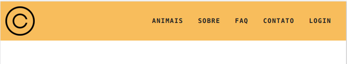
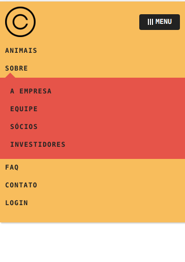

# Menu Mobile

Um Menu Mobile feito com CSS/JavaScript puro, sendo reutilizável através de classes(ES6).

## Exemplo de Utilização

Este menu mobile foi construído utilizando um dropdown vindo do repositório:
https://github.com/WillRy/dropdown-menu

Para isso, é necessário:

- Obter os assets do dropdown, contidos na pasta **./dist** do repositório(https://github.com/WillRy/dropdown-menu).
- Obter os assets do menu, vindos da pasta **./dist**

**Imagem:**

Menu Normal:



Menu Responsivo:



**Código:**

```html
<nav class="menu" data-menu="suave">
  <div class="logo">
    
  </div>
  <button data-menu="button" aria-expanded="false" aria-controls="menu">Menu</button>
  <ul data-menu="list" id="menu">
    <li><a href="#animais">Animais</a></li>
    <li data-dropdown data-dropdown-hover>
      <a href="sobre.html">Sobre</a>
      <ul class="dropdown-menu">
        <li><a href="empresa.html">A empresa</a></li>
        <li><a href="equipe.html">Equipe</a></li>
        <li><a href="socios.html">Sócios</a></li>
        <li><a href="investidores.html">Investidores</a></li>
      </ul>
    </li>
    <li><a href="#faq">Faq</a></li>
    <li><a href="#contato">Contato</a></li>
    <li>
      <a data-modal="abrir" href="login.html">Login <span class="arrow-black"></span></a>
    </li>
  </ul>
</nav>
<script src="./dist/dropdown-menu.js"></script>
<script src="./dist/menu-mobile.js"></script>
<script>
  // Configuração do dropdown utilizado no menu
  // Primeiro parâmetro: seletor que indica elementos que possuem dropdown
  const dropdownMenu = new DropdownMenu('[data-dropdown]');
  dropdownMenu.init();

  // Configuração do menu mobile
  // Primeiro parâmetro: Seletor do botão que abre o menu
  // Segundo parâmetro:  Seletor que indica onde está o menu que será aberto
  const menuMobile = new MenuMobile('[data-menu="button"]', '[data-menu="list"]');
  menuMobile.init();
</script>
```

## Testar Utilização

Para testar a utilização: É possível através do arquivo **./exemplo.html**

Para desenvolver: Utilize o arquivo **./index.html**

## Estilização

Para melhor capacidade de estilização, o CSS não está minificado, permitindo
ser customizado com facilidade.

Para modificar o estilo do menu mobile, edite o estilo baixado da pasta **./dist**

## Funcionamento

O Menu Mobile está configurado utilizando flexbox, com isso, centraliza corretamente
os elementos na vertical.

Está configurado para ter uma altura de 80px, com isso é necessário incluir
logos que não ultrapassem esse tamanho.

O Menu faz uso de um **outsideClick**, um script que detecta o clique fora e realiza o fechamento dos dropdowns internos e do menu.
